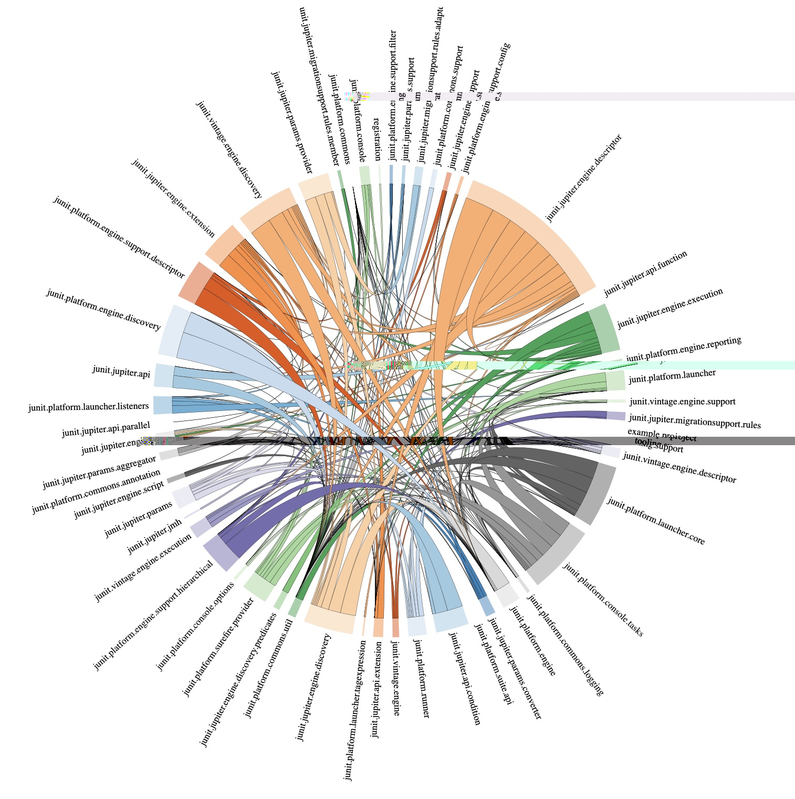
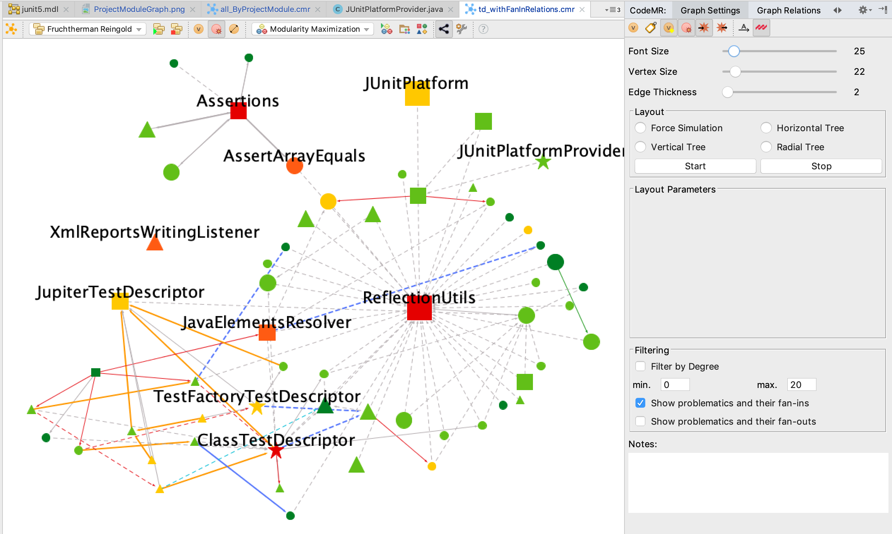
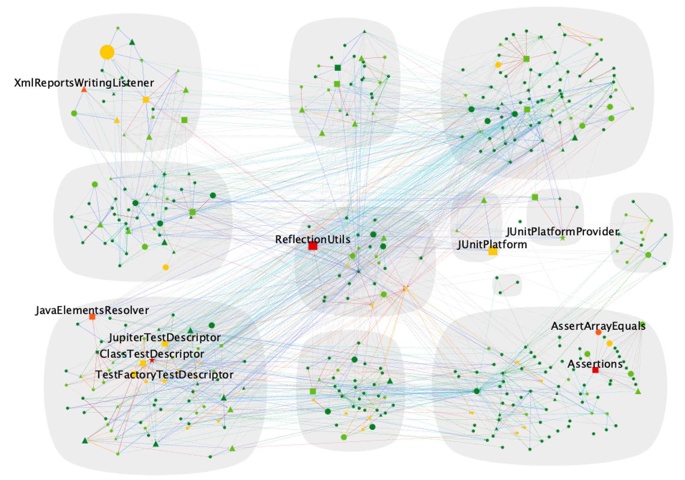
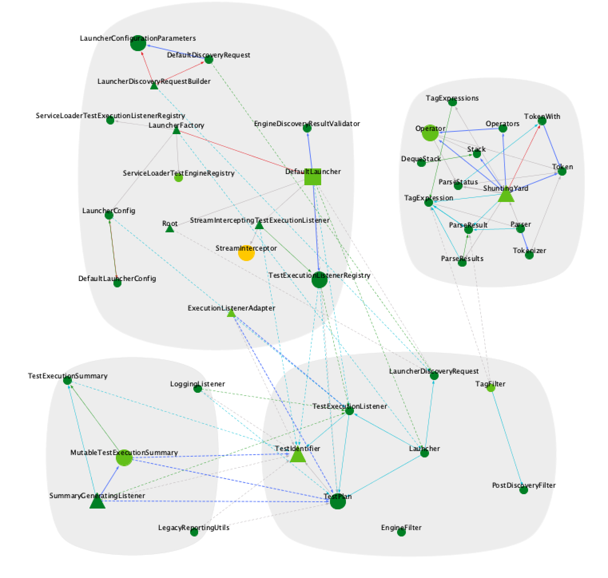
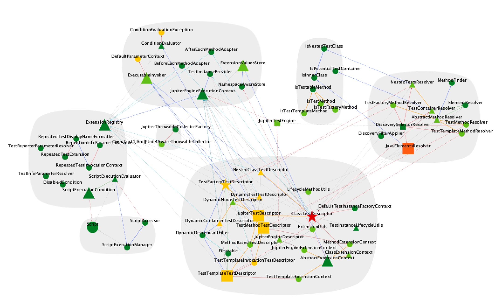

# JUnit 5
JUnit is a simple framework to write repeatable tests. It is an instance of the xUnit architecture for unit testing frameworks.

## JUnit5 README

Please see [JUnit5 README](README-JUnit5.md) in the root directory of the project.

CodeMR Report
=================

You can download or clone the project to use the existing extracted model and graphs. 
You can create your graphs, your working sets and analyse the project based on the extracted model without limitation. 
You can download CodeMR plugins for your favorite IDE from:
- [CodeMR for IntelliJ](https://plugins.jetbrains.com/plugin/10811-codemr)
- [CodeMR for Eclipse](https://marketplace.eclipse.org/content/codemr-software-quality-tool) 

Access to the online report from  [CodeMR HTML Report](https://codemr.co.uk/case-reports/junit5/main_report/htmlx/lbd/dashboard.html) .

See CodeMR [web site](https://www.codemr.co.uk) for details on the CodeMR.

Download [trial license](https://www.codemr.co.uk/downloads) to try CodeMR for other projects.

CodeMR model path:
CodeMR model path: ./codemr/junit5/junit5.mdl

### Snapshots ###

#### Model Views #### 
- Overview 1

- Overview 2

 
- TreeMap View (Colors by Complexity)

- Package Structure View (Colors by Cohesion)

-Package Dependency View 

- Outline View 

#### Project Graphs #### 
- Critial Classes and Relations
 

- Project Modul Graph

- Platform Engine by Modularity
 

- Platform Commons by Package
 

- Platform Console by Package
 

- Platform Launcher by Package
 

- Jupiter Api by Package
 

- Jupiter Engine by Package
 

- Jupiter Params by Package
 

- All Inheritance (Radial Tree Layout)

- Descriptor Inheritance 

